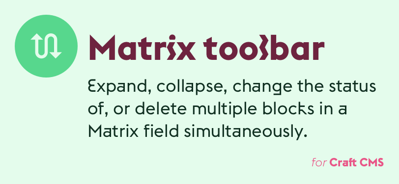

# Matrix Toolbar plugin for Craft CMS 3.x

Expand, collapse, change the status of, or delete multiple blocks in a Matrix field simultaneously.

## Requirements

This plugin requires Craft CMS 3.0.27 or later.

## Installation

To install the plugin, follow these instructions.

1. Open your terminal and go to your Craft project:

        cd /path/to/project

2. Then tell Composer to load the plugin:

        composer require monachilada/craft-matrixtoolbar

3. In the Control Panel, go to Settings → Plugins and click the “Install” button for Matrix Toggle.

## Matrix Toolbar Overview

Matrix fields are great, but working with multiple blocks at a time can sometimes be finicky and the in-built features aren't always intuitive to content editors. This plugin adds a toolbar above every Matrix field to more easily expose tools for selecting, collapsing, expanding, changing the status and deleting multiple Matrix blocks simultaneously.

## Using Matrix Toolbar

The toolbar will appear above Matrix fields and should feel pretty familiar from the Entries page and other areas of the Control Panel.

## Matrix Toolbar Roadmap

Some things to do, and ideas for potential features:

* Make the toolbar work for Matrix fields inside global sets.
* Better handling of when new blocks are added or deleted from a Matrix field.
* Add a search field to the toolbar, so that blocks with fields that have matching results can be highlighted.

Brought to you by [Mike Pierce](https://michaelpierce.trade/)
